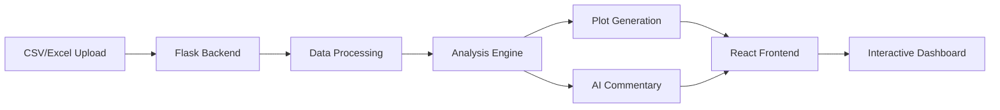

# 🏐 Volley Stats

[](https://volley-stats-ui.onrender.com)
[](LICENSE)
[](https://python.org)
[](https://reactjs.org)

**Transform your volleyball data into actionable insights with AI-powered analytics and beautiful visualizations.**

🔗 **[Try the Live App](https://volley-stats-ui.onrender.com)** | 📊 **[API Documentation](https://volley-stats.onrender.com)** 

---

## 🌟 Why Volley Stats?

This all started when I was captaining a volleyball team in an adult league. Watching VODs, I wanted to go beyond just cheering and cringing at our plays. I wanted to draw actual insights to help me and my teammates grow. I started tracking stats to identify player strengths, weaknesses, and room for growth. 

As much fun as it was tinkering with numbers and Python code, I didn't want to keep this for myself, as it could help many others. No one else needs to spend countless hours writing code to understand their gameplay like I did. So, I built **Volley Stats** to make that journey easier for anyone who loves the sport.

Here's to fewer hours in front of the keyboard and more on the court! 🏐

---

## ✨ Features

### 📊 Advanced Analytics
- **Performance Metrics**: Track serve accuracy, attack efficiency, receive quality, and error rates
- **Temporal Analysis**: View trends over time with interactive charts
- **Player Comparisons**: Compare individual players or analyze team performance
- **AI Commentary**: Get intelligent insights powered by HuggingFace models

### 🎨 Modern Web Interface  
- **Drag & Drop Upload**: Simply drop your CSV/Excel files to start analyzing
- **Interactive Visualizations**: Beautiful charts with Matplotlib and Seaborn
- **Responsive Design**: Works seamlessly on desktop, tablet, and mobile
- **Real-time Processing**: Instant analysis and visualization generation

### 🤖 AI-Powered Insights
- **Smart Commentary**: LLM-generated performance analysis
- **Vision Analysis**: Computer vision models analyze plot patterns
- **Personalized Recommendations**: Get actionable advice for improvement
- **Multiple Analysis Modes**: Cumulative stats or temporal trends

---

## 🚀 Live Demo

### Quick Links
- 🎯 **[Web Application](https://volley-stats-ui.onrender.com)** - Full-featured React interface
- 🔧 **[API Endpoint](https://volley-stats-api.onrender.com/api/health)** - RESTful API for developers
- 📊 **[Sample Data](sample_data.csv)** - Example dataset to get started

### Status


---

## 🏗️ Architecture



### Tech Stack

#### Frontend
- **React 18** - Modern UI framework
- **Vite** - Lightning-fast build tool
- **React Router** - Client-side routing
- **CSS3** - Custom animations and glass-morphism effects

#### Backend  
- **Flask** - Python web framework
- **Pandas** - Data manipulation
- **Matplotlib/Seaborn** - Visualization
- **Gunicorn** - Production WSGI server

#### AI/ML
- **HuggingFace Transformers** - LLM integration
- **SmolVLM** - Vision-language models
- **Custom Models** - Volleyball-specific analytics

---

## 📁 Repository Structure

```
volley-stats/
├── src/
│   ├── client/               # React frontend
│   │   ├── src/
│   │   │   ├── pages/       # React pages
│   │   │   ├── components/  # Reusable components
│   │   │   └── api.js       # API integration
│   │   └── package.json
│   │
│   └── server/               # Flask backend
│       ├── app.py           # Main Flask application
│       ├── services/        # Business logic
│       │   ├── analysis.py  # Data analysis
│       │   ├── plotting.py  # Chart generation
│       │   ├── agents.py    # AI commentary
│       │   └── model_config.py
│       └── requirements.txt
│
├── Data Collection.xlsx      # Excel template
├── sample_data.csv          # Example dataset
├── Volley_Analysis.ipynb    # Jupyter notebook
├── render.yaml              # Deployment config
├── LICENSE                  # GPL-3.0
└── README.md
```

---

## 🔧 Installation

### Quick Start (Jupyter Notebook)

```bash
# Clone the repository
git clone https://github.com/JasmolSD/volley-stats.git
cd volley-stats

# Install dependencies
pip install -r requirements.txt

# Open the notebook
jupyter notebook Volley_Analysis.ipynb
```

### Full Web Application

#### Backend Setup

```bash
# Navigate to server directory
cd app/server

# Create virtual environment
python -m venv venv
source venv/bin/activate  # On Windows: venv\Scripts\activate

# Install dependencies
pip install -r requirements.txt

# Set environment variables (create .env file)
echo "HF_TOKEN=your_token_here" > services/.env

# Run the Flask server
python app.py
```

#### Frontend Setup

```bash
# Navigate to client directory
cd app/client

# Install dependencies
npm install

# Run development server
npm run dev
```

Visit `http://localhost:5173` to see the app!

---

## 📊 Usage Guide

### 1. Prepare Your Data
Use the provided `Data Collection.xlsx` template or format your CSV with these columns:
- Player names, positions, dates
- Serve attempts, aces, errors
- Attack attempts, kills, errors  
- Receive attempts, quality scores
- Block and assist statistics

### 2. Upload & Analyze
1. Visit the [web app](https://volley-stats-ui.onrender.com)
2. Drag and drop your CSV/Excel file
3. Select analysis mode (Cumulative or Temporal)
4. Choose a player or view team statistics

### 3. Explore Insights
- View interactive charts and graphs
- Read AI-generated commentary
- Download reports and visualizations
- Track progress over time

---

## 🌐 API Documentation

### Endpoints

| Method | Endpoint | Description |
|--------|----------|-------------|
| `GET` | `/api/health` | Health check |
| `POST` | `/api/upload` | Upload data file |
| `GET` | `/api/players` | List all players |
| `GET` | `/api/plot` | Generate plot |
| `POST` | `/api/commentary` | Get AI analysis |
| `GET` | `/api/summary` | Performance summary |

### Example Request

```javascript
// Upload a file
const formData = new FormData();
formData.append('file', csvFile);

const response = await fetch('https://volley-stats-api.onrender.com/api/upload', {
  method: 'POST',
  body: formData
});
```

---

## 📸 Screenshots

### Dashboard View


### Temporal Analysis


---

## 🚀 Deployment

The app is deployed on [Render](https://render.com) using the free tier:

[](https://render.com/deploy)

### Deployment Configuration
- **Frontend**: Static React site with CDN
- **Backend**: Flask API with Gunicorn
- **Auto-deploy**: Enabled from main branch
- **Health checks**: Automated monitoring

See [`render.yaml`](render.yaml) for full deployment configuration.

---

## 🤝 Contributing

Contributions are welcome! Whether you're fixing bugs, adding features, or improving documentation, we'd love your help.

### How to Contribute

1. Fork the repository
2. Create a feature branch (`git checkout -b feature/AmazingFeature`)
3. Commit your changes (`git commit -m 'Add AmazingFeature'`)
4. Push to the branch (`git push origin feature/AmazingFeature`)
5. Open a Pull Request

### Development Guidelines
- Follow PEP 8 for Python code
- Use ESLint for JavaScript
- Write tests for new features
- Update documentation as needed

---

## 📜 License

This project is licensed under the **GPL-3.0 License** - see the [LICENSE](LICENSE) file for details.

---

## 🙏 Acknowledgments

- My volleyball team for inspiring this project
- The open-source community for amazing tools
- HuggingFace for AI model access
- Everyone who's contributed feedback and ideas

---

## 💬 Contact

**Jasmol S. Dhesi**  
🔗 [GitHub](https://github.com/JasmolSD) | 🏐 [LinkedIn](https://www.linkedin.com/in/jasmoldhesi/)

---

## 🎯 Roadmap

- [ ] Advanced data collection tool
- [ ] Video analysis integration
- [ ] Team collaboration features
- [ ] Advanced ML predictions
- [ ] Export to PDF reports

---

<div align="center">
  
**Built with ❤️ for the volleyball community**

*Star ⭐ this repo if you find it helpful!*

</div>
